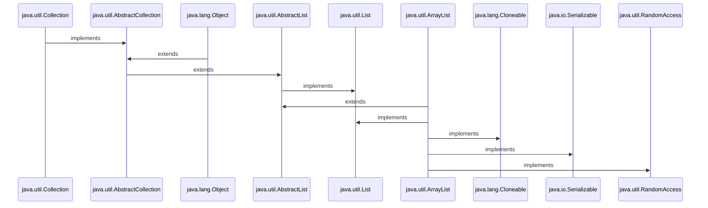

<h1 align="Center">Java Collection-List </h1>

<h3>The <i>List</i> interface extends Collection and declares the behavior of a collection that stores a sequence of elements. Elements can be inserted or accessed by
their position in the list, using a zero-based index. A list may contain duplicate elements. List is a generic interface that has this declaration:</h3>

<h3 align="Center">

```
public interface List<E> extends Collection<E>

```
</h3>

<h3>Here, E specifies the type of objects that the list will hold.</h3>

<h3>List in Java provides the facility to maintain the ordered collection. It contains the index-based methods to insert, update, delete and search the elements. It can have the duplicate elements also. We can also store the null elements in the list.</h3>
  
 <h3> The List interface is found in the <i>java.util</i> package and inherits the Collection interface.</h3>
  
   <h3> <li><i>1.Collection:</i> → It is the top of the collection hierarchy.It supports basic grouping of elements.</li></h3>
  <h3> <li><i>2.AbstractCollection:</i> → It implements the <i>Collection</i> interface.</li></h3>
  <h3> <li><i>3.List:</i> → It extends <i>Collection</i> to implement lists of objects.</li></h3>
  <h3> <li><i>4.AbstractList:</i> → It extends  the <i>AbstractCollection</i> and implements the <i>List</i> interface.</li></h3>
  <h3> <li><i>5.AbstractSequentialList:</i> → It extends  the <i>AbstractList</i> into a sequential(not random access)list.</li></h3>
  <h3> <li><i>6.LinkedList:</i> → It extends the <i>AbstractSequentialList</i> into a linked list, where each element knows where the next element is.</li></h3>
  <h3> <li><i>7.ArrayList:</i> → It implements a dynamic(resizable) array.</li></h3>
  
 
  
  <h1></h1>
  <h1 align="Center"> AbstractList</h1>
  <ul>
  
  ```mermaid
  
  sequenceDiagram
 
java.util.Collection->>java.util.AbstractCollection:implements
java.lang.Object->>java.util.AbstractCollection:extends
java.util.AbstractCollection->>java.util.AbstractList:extends 
java.util.AbstractList->>java.util.List:implements

  
  ```
  
  <h3 align="Center">
  
  ```
public abstract class AbstractList<E>
extends AbstractCollection<E>
implements List<E>
    
public abstract class AbstractCollection<E>
extends Object
implements Collection<E>
  
  ```
  </h3>
  
<h3>The <i>AbstractList Class</i> is an Abstract Class extends another Abstract Class AbstractCollection and implements List interface  .Note AbstractCollection , the abstract class which implements Collection interface and extends the Object class , the parent class of all the classes. The AbstractList is the foundation of other classes such as ArrayList, which supports dynamic arrays. </h3>
  </ul>
    
  <h1></h1>
  <h1 align="Center"> Division of AbstractList</h1>
  <ul>
    

  
  ```mermaid
    
    graph TD;
    
    Object-->|extends| AbstractCollection;
    Object-->|extends|CopyOnWriteArrayList;
    AbstractCollection-->|implements| Collection;
    AbstractList-->|extends|AbstractCollection;
    List-->|implements|AbstractList;
    List-->|implements|CopyOnWriteArrayList;
    AbstractList-->|extends|ArrayList;
    AbstractList-->|extends|AbstractSequentialList;
    AbstractList-->|extends|Vector;
    AbstractSequentialList-->|extends|LinkedList;
   
  ```
  
 <h3> <i><ins>Note:</ins> The Vector class is deprecated since Java 5. Deprecated means it is supported but less in use or not recommended. Where as,  ArrayList and LinkedList are widely used in Java programming. </i></h3> 
 
  </ul>
   
 <h1></h1>
<h1 align="Center">Array List</h1>
    
<ul>
  
 <h3>The ArrayList class is an array class that can grow or shrink at runtime . Note that arrays of this class must hold objects, not just simple data types.The ArrayList class extends AbstractList and implements the List interface.ArrayList is a generic class that has this declaration:</h3>
  

  
<h3 align="Center">
  
```
  
public class ArrayList<E>
extends AbstractList<E>
implements List<E>, RandomAccess, Cloneable, Serializable
  
  
  //Others
 ---------------------------------------
public abstract class AbstractList<E>
extends AbstractCollection<E>
implements List<E>
    
public abstract class AbstractCollection<E>
extends Object
implements Collection<E>
  
--------------------------------
  
  Class/Interface      Package
  --------------       ----------
  ArrayList             java.util
  AbstractList          java.util
  List<E>               java.util
  RandomAccess          java.util
  Cloneable             java.lang
 Serializable          java.io
  AbstractCollection    java.util
  Object                java.lang
  Collection            java.util
  
  
```
</h3>
  
<h3><i> Characteristic of ArrayList are:</i></h3>
  <ul>
    <h3><li><i>1. Java ArrayList class can contain duplicate elements.</i></li></h3>
    <h3><li><i>2. Java ArrayList class maintains insertion order.</i></li></h3>
    <h3><li><i>3.Java ArrayList class is non synchronized. <ins>Note:</ins> Vector class of Java is synchronized .</i></li></h3>
    <h3><li><i>4.Java ArrayList allows random access because the array works on an index basis.</i></li></h3>
    <h3><li><i>5.In ArrayList, manipulation is a little bit slower than the LinkedList in Java because a lot of shifting needs to occur if any element is removed from the array list.</i></li></h3>
    <h3><li><i>6.ArrayList in Java can be seen as a VECTOR in C++ STL library.</i></li></h3>
    <h3><li><i>7.We can not create an array list of the primitive types, such as int, float, char, etc. It is required to use the required wrapper class.That is it follows : <a href="https://github.com/AvinandanBose/JavaGeneric"> Generic</a> characteristics. </i></li></h3>
    
   </ul>
   
 
  
  

  
   
   <h2></h2>
   <h2 align="Center"> Constructors Of ArrayList</h2>
   
   <ul>
   
   <h3><li> <a href="https://github.com/AvinandanBose/JavaCollection_List/blob/main/ArrayList1.java"> 1. ArrayList().</li></h3>
     
```Syntax

Definition: The above constructor builds an empty array list.
     
     
 ```
     
   <h3><li> <a href="https://github.com/AvinandanBose/JavaCollection_List/blob/main/ArrayList2.java"> 2. ArrayList( Collection < ? extends E > c ) .</li></h3>
     
```Syntax
 
Definition: This constructor builds an array list, 
that is initialized with the  elements of the collection c.
     
```
   <h3><li> <a href="https://github.com/AvinandanBose/JavaCollection_List/blob/main/ArrayList3.java"> 3. ArrayList( int capacity ) .</li></h3>
     
```Syntax
 
 Definition: This constructor builds an array list that has the initial capacity. 
 
 Capacity: The capacity is the size of the underlying array that is used to store the elements . 
 The capacity grows automatically as elements are added to an array list.
     
```
   
   </ul>
   
   
 <h2></h2>
<h2 align="Center"> Methods of ArrayList</h2>


<ul>
 <h3><li> <a href="https://github.com/AvinandanBose/JavaCollection_List/blob/main/ArrayList4.java"> 1. add( int index, Object element ) .</li></h3>
 
 ```Syntax
 
 Definition: This method is used to insert a specific element,
  at a specific position index in a list.
  
  Note: 
  
  In the above example :
  
   for (int i = 0; i < arrayList.size(); i++) {
            if(i==1){
                arrayList.add(i,"world");
            }
            
        }
        
    When we get the index = 1 , and it will add 
    world at index : 1 .
    
    And it will add the element and size of the ArrayList will get,
    increased. And the previous element existed at index 1 will become 2.
        
        
     
```

 <h3><li> <a href="https://github.com/AvinandanBose/JavaCollection_List/blob/main/ArrayList5.java"> 2. add(Object o) .</li></h3>
 
  ```Syntax
  
   Definition: It is used to append the specified element at the end of a list.
   
   Like:
   
   arrayList.add(1);
   
   [1]
   
   Then if we add: 
   
   arrayList.add(2);
   
   It will be:
   
   [1,2]
   
   i.e. It will add element from end.
  
  
  ```
 
  <h3><li> <a href="https://github.com/AvinandanBose/JavaCollection_List/blob/main/ArrayList6.java"> 3. addAll ( Collection C ) .</li></h3>
  
  ```Syntax
  
   Definition: This method is used to append all the elements ,
   from a specific collection to the end of the mentioned list, 
   in such an order that the values are returned by the specified,
   collection’s iterator.
   
  :If the ArrayList is Raw Type:
  --------------------------------
  
  List  add any type of element dynamically,
  Without type checking.
  
   :If the ArrayList is Generic Type:
  --------------------------------
  
  List  add that specific type of element dynamically,
  With type checking.
  
  ```
  
 <h3><li> <a href="https://github.com/AvinandanBose/JavaCollection_List/blob/main/ArrayList7.java"> 4. addAll ( int index , Collection C ) .</li></h3>
 
  ```Syntax
  
   Definition: Used to insert all of the elements ,
   starting at the specified position from a ,
   specific collection into the mentioned list.
   
   :If the ArrayList is Raw Type:
  --------------------------------
  
  List  add any type of element dynamically,
  Without type checking.
  
   :If the ArrayList is Generic Type:
  --------------------------------
  
  List  add that specific type of element dynamically,
  With type checking.
 
  
  ```
  <h3><li> <a href="https://github.com/AvinandanBose/JavaCollection_List/blob/main/ArrayList8.java"> 5. clear() .</li></h3>
  
  ```Syntax
  
   Definition: This method is used to remove all the elements from any list.
 
  
  ```
  
   <h3><li> <a href="https://github.com/AvinandanBose/JavaCollection_List/blob/main/ArrayList9.java"> 6. clone() .</li></h3>
  
  ```Syntax
  
   Definition: This method is used to return a shallow copy of an ArrayList.
 
  
  ```
     
   <h3><li> <a href="https://github.com/AvinandanBose/JavaCollection_List/blob/main/ArrayList10.java"> 7. contains ( Object o ) .</li></h3>
  
  ```Syntax
  
   Definition: Returns (Boolean) true if this list contains the specified element.
 
  
  ```
     
  <h3><li> <a href="https://github.com/AvinandanBose/JavaCollection_List/blob/main/ArrayList11.java"> 8. ensureCapacity ( int minCapacity ) .</li></h3>
     
  
  ```Syntax
  
  Definition: Increases the capacity of this ArrayList instance, if necessary, 
  to ensure that it can hold at least the number of elements specified by the
  minimum capacity argument.
 
  
  ```
  
  <h3><li> <a href="https://github.com/AvinandanBose/JavaCollection_List/blob/main/ArrayList12.java"> 9. forEach?(Consumer < ? super E > action) .</li></h3>
     
  
  ```Syntax
  
  Definition: Performs the given action for each element of the Iterable,
  until all elements have been processed or the action throws an exception.
 
  
  ```
    
  <h3><li> <a href="https://github.com/AvinandanBose/JavaCollection_List/blob/main/ArrayList13.java"> 10. get ( int index ) .</li></h3>
     
  
  ```Syntax
  
  Definition: Returns the element at the specified position in this list.
 
  
  ```
    
  <h3><li> <a href="https://github.com/AvinandanBose/JavaCollection_List/blob/main/ArrayList14.java"> 11.indexOf ( Object O) .</li></h3>
    
 ```Syntax
  
  Definition: The index the first occurrence of a specific element is either returned, 
    or -1 in case the element is not in the list. That is it returns Integer which is 
    an index .
 
  
  ```
  
   <h3><li> <a href="https://github.com/AvinandanBose/JavaCollection_List/blob/main/ArrayList15.java"> 11. isEmpty ( ) .</li></h3>
    
 ```Syntax
  
  Definition: Returns true if this list contains no elements.
  
  ```
  <h3><li> <a href="https://github.com/AvinandanBose/JavaCollection_List/blob/main/ArrayList16.java"> 12. lastIndexOf ( Object O ) .</li></h3>
    
  ```Syntax
  
  Definition: The index of the last occurrence of a specific element ,
    is either returned or -1 in case the element is not in the list.
    
    : i.e. :
    
    arrayList.add("Hello");
    arrayList.add("World");
    arrayList.add("!");
    arrayList.add("Hello");
    arrayList.add("World");
    arrayList.add("!");
    
    arrayList.lastIndexOf("Hello") = 3
  
  ```
  
   <h3><li> <a href="https://github.com/AvinandanBose/JavaCollection_List/blob/main/ArrayList17.java"> 13. listIterator ( ) .</li></h3>
    
  ```Syntax
  
  Definition: Returns a list iterator over the elements in this list 
  (in proper sequence).
   
  
  ```
  
   <h3><li> <a href="https://github.com/AvinandanBose/JavaCollection_List/blob/main/ArrayList18.java"> 14. listIterator( int index) .</li></h3>
   
 ```Syntax
  
  Definition: Returns a list iterator over the elements in this list (in proper sequence), 
  starting at the specified position in the list.
   
  
  ```
  
 <h3><li> <a href="https://github.com/AvinandanBose/JavaCollection_List/blob/main/ArrayList19.java"> 15. remove ( int index ) .</li></h3>
   
 ```Syntax
  
  Removes the element at the specified position in this list.
   
  
  ```
  
  
</ul>  
</ul>


