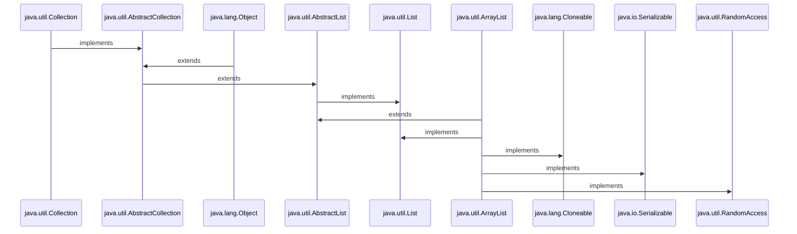
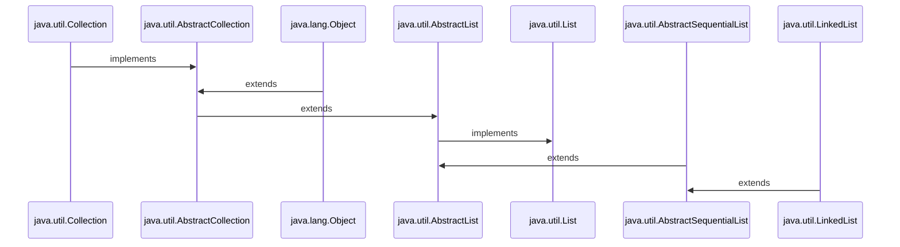
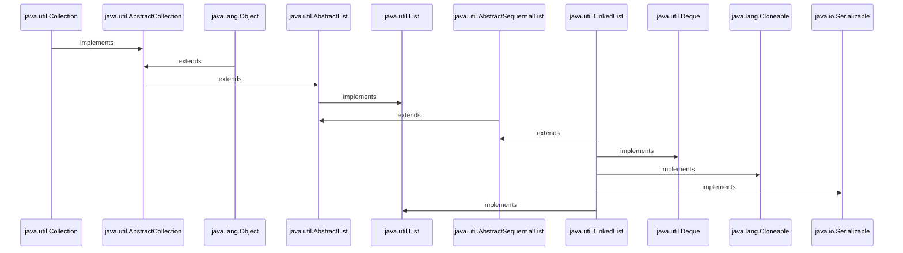

<h1 align="Center">Java Collection-List </h1>

<h3>The <i>List</i> interface extends Collection and declares the behavior of a collection that stores a sequence of elements. Elements can be inserted or accessed by
their position in the list, using a zero-based index. A list may contain duplicate elements. List is a generic interface that has this declaration:</h3>

<h3 align="Center">

```
public interface List<E> extends Collection<E>

```
</h3>

<h3>Here, E specifies the type of objects that the list will hold.</h3>

<h3>List in Java provides the facility to maintain the ordered collection. It contains the index-based methods to insert, update, delete and search the elements. It can have the duplicate elements also. We can also store the null elements in the list.</h3>
  
 <h3> The List interface is found in the <i>java.util</i> package and inherits the Collection interface.</h3>
  
   <h3> <li><i>1.Collection:</i> → It is the top of the collection hierarchy.It supports basic grouping of elements.</li></h3>
  <h3> <li><i>2.AbstractCollection:</i> → It implements the <i>Collection</i> interface.</li></h3>
  <h3> <li><i>3.List:</i> → It extends <i>Collection</i> to implement lists of objects.</li></h3>
  <h3> <li><i>4.AbstractList:</i> → It extends  the <i>AbstractCollection</i> and implements the <i>List</i> interface.</li></h3>
  <h3> <li><i>5.AbstractSequentialList:</i> → It extends  the <i>AbstractList</i> into a sequential(not random access)list.</li></h3>
  <h3> <li><i>6.LinkedList:</i> → It extends the <i>AbstractSequentialList</i> into a linked list, where each element knows where the next element is.</li></h3>
  <h3> <li><i>7.ArrayList:</i> → It implements a dynamic(resizable) array.</li></h3>
  
 
  
  <h1></h1>
  <h1 align="Center"> AbstractList</h1>
  <ul>
  
  ```mermaid
  
  sequenceDiagram
 
java.util.Collection->>java.util.AbstractCollection:implements
java.lang.Object->>java.util.AbstractCollection:extends
java.util.AbstractCollection->>java.util.AbstractList:extends 
java.util.AbstractList->>java.util.List:implements

  
  ```
  
  <h3 align="Center">
  
  ```
public abstract class AbstractList<E>
extends AbstractCollection<E>
implements List<E>
    
public abstract class AbstractCollection<E>
extends Object
implements Collection<E>
  
  ```
  </h3>
  
<h3>The <i>AbstractList Class</i> is an Abstract Class extends another Abstract Class AbstractCollection and implements List interface  .Note AbstractCollection , the abstract class which implements Collection interface and extends the Object class , the parent class of all the classes. The AbstractList is the foundation of other classes such as ArrayList, which supports dynamic arrays. </h3>
  </ul>
    
  <h1></h1>
  <h1 align="Center"> Division of AbstractList</h1>
  <ul>
    

  
  ```mermaid
    
    graph TD;
    
    Object-->|extends| AbstractCollection;
    Object-->|extends|CopyOnWriteArrayList;
    AbstractCollection-->|implements| Collection;
    AbstractList-->|extends|AbstractCollection;
    List-->|implements|AbstractList;
    List-->|implements|CopyOnWriteArrayList;
    AbstractList-->|extends|ArrayList;
    AbstractList-->|extends|AbstractSequentialList;
    AbstractList-->|extends|Vector;
    AbstractSequentialList-->|extends|LinkedList;
   
  ```
  
 <h3> <i><ins>Note:</ins> The Vector class is deprecated since Java 5. Deprecated means it is supported but less in use or not recommended. Where as,  ArrayList and LinkedList are widely used in Java programming. </i></h3> 
 
  </ul>
   
 <h1></h1>
<h1 align="Center">Array List</h1>
    
<ul>
  
 <h3>The ArrayList class is an array class that can grow or shrink at runtime . Note that arrays of this class must hold objects, not just simple data types.The ArrayList class extends AbstractList and implements the List interface.ArrayList is a generic class that has this declaration:</h3>
  

  
<h3 align="Center">
  
```
  
public class ArrayList<E>
extends AbstractList<E>
implements List<E>, RandomAccess, Cloneable, Serializable
  
  
  //Others
 ---------------------------------------
public abstract class AbstractList<E>
extends AbstractCollection<E>
implements List<E>
    
public abstract class AbstractCollection<E>
extends Object
implements Collection<E>
  
--------------------------------
  
  Class/Interface      Package
  --------------       ----------
  ArrayList             java.util
  AbstractList          java.util
  List<E>               java.util
  RandomAccess          java.util
  Cloneable             java.lang
 Serializable          java.io
  AbstractCollection    java.util
  Object                java.lang
  Collection            java.util
  
  
```
</h3>
  
<h3><i> Characteristic of ArrayList are:</i></h3>
  <ul>
    <h3><li><i>1. Java ArrayList class can contain duplicate elements.</i></li></h3>
    <h3><li><i>2. Java ArrayList class maintains insertion order.</i></li></h3>
    <h3><li><i>3.Java ArrayList class is non synchronized. <ins>Note:</ins> Vector class of Java is synchronized .</i></li></h3>
    <h3><li><i>4.Java ArrayList allows random access because the array works on an index basis.</i></li></h3>
    <h3><li><i>5.In ArrayList, manipulation is a little bit slower than the LinkedList in Java because a lot of shifting needs to occur if any element is removed from the array list.</i></li></h3>
    <h3><li><i>6.ArrayList in Java can be seen as a VECTOR in C++ STL library.</i></li></h3>
    <h3><li><i>7.We can not create an array list of the primitive types, such as int, float, char, etc. It is required to use the required wrapper class.That is it follows : <a href="https://github.com/AvinandanBose/JavaGeneric"> Generic</a> characteristics. </i></li></h3>
    
   </ul>
   
 
  
  

  
   
   <h2></h2>
   <h2 align="Center"> Constructors Of ArrayList</h2>
   
   <ul>
   
   <h3><li> <a href="https://github.com/AvinandanBose/JavaCollection_List/blob/main/ArrayList1.java"> 1. ArrayList().</li></h3>
     
```Syntax

Definition: The above constructor builds an empty array list.
     
     
 ```
     
   <h3><li> <a href="https://github.com/AvinandanBose/JavaCollection_List/blob/main/ArrayList2.java"> 2. ArrayList( Collection < ? extends E > c ) .</li></h3>
     
```Syntax
 
Definition: This constructor builds an array list, 
that is initialized with the  elements of the collection c.
     
```
   <h3><li> <a href="https://github.com/AvinandanBose/JavaCollection_List/blob/main/ArrayList3.java"> 3. ArrayList( int capacity ) .</li></h3>
     
```Syntax
 
 Definition: This constructor builds an array list that has the initial capacity. 
 
 Capacity: The capacity is the size of the underlying array that is used to store the elements . 
 The capacity grows automatically as elements are added to an array list.
     
```
   
   </ul>
   
   
 <h2></h2>
<h2 align="Center"> Methods of ArrayList</h2>


<ul>
 <h3><li> <a href="https://github.com/AvinandanBose/JavaCollection_List/blob/main/ArrayList4.java"> 1. add( int index, Object element ) .</li></h3>
 
 ```Syntax
 
 Definition: This method is used to insert a specific element,
  at a specific position index in a list.
  
  Note: 
  
  In the above example :
  
   for (int i = 0; i < arrayList.size(); i++) {
            if(i==1){
                arrayList.add(i,"world");
            }
            
        }
        
    When we get the index = 1 , and it will add 
    world at index : 1 .
    
    And it will add the element and size of the ArrayList will get,
    increased. And the previous element existed at index 1 will become 2.
        
        
     
```

 <h3><li> <a href="https://github.com/AvinandanBose/JavaCollection_List/blob/main/ArrayList5.java"> 2. add(Object o) .</li></h3>
 
  ```Syntax
  
   Definition: It is used to append the specified element at the end of a list.
   
   Like:
   
   arrayList.add(1);
   
   [1]
   
   Then if we add: 
   
   arrayList.add(2);
   
   It will be:
   
   [1,2]
   
   i.e. It will add element from end.
  
  
  ```
 
  <h3><li> <a href="https://github.com/AvinandanBose/JavaCollection_List/blob/main/ArrayList6.java"> 3. addAll ( Collection C ) .</li></h3>
  
  ```Syntax
  
   Definition: This method is used to append all the elements ,
   from a specific collection to the end of the mentioned list, 
   in such an order that the values are returned by the specified,
   collection’s iterator.
   
  :If the ArrayList is Raw Type:
  --------------------------------
  
  List  add any type of element dynamically,
  Without type checking.
  
   :If the ArrayList is Generic Type:
  --------------------------------
  
  List  add that specific type of element dynamically,
  With type checking.
  
  ```
  
 <h3><li> <a href="https://github.com/AvinandanBose/JavaCollection_List/blob/main/ArrayList7.java"> 4. addAll ( int index , Collection C ) .</li></h3>
 
  ```Syntax
  
   Definition: Used to insert all of the elements ,
   starting at the specified position from a ,
   specific collection into the mentioned list.
   
   :If the ArrayList is Raw Type:
  --------------------------------
  
  List  add any type of element dynamically,
  Without type checking.
  
   :If the ArrayList is Generic Type:
  --------------------------------
  
  List  add that specific type of element dynamically,
  With type checking.
 
  
  ```
  <h3><li> <a href="https://github.com/AvinandanBose/JavaCollection_List/blob/main/ArrayList8.java"> 5. clear() .</li></h3>
  
  ```Syntax
  
   Definition: This method is used to remove all the elements from any list.
 
  
  ```
  
   <h3><li> <a href="https://github.com/AvinandanBose/JavaCollection_List/blob/main/ArrayList9.java"> 6. clone() .</li></h3>
  
  ```Syntax
  
   Definition: This method is used to return a shallow copy of an ArrayList.
 
  
  ```
     
   <h3><li> <a href="https://github.com/AvinandanBose/JavaCollection_List/blob/main/ArrayList10.java"> 7. contains ( Object o ) .</li></h3>
  
  ```Syntax
  
   Definition: Returns (Boolean) true if this list contains the specified element.
 
  
  ```
     
  <h3><li> <a href="https://github.com/AvinandanBose/JavaCollection_List/blob/main/ArrayList11.java"> 8. ensureCapacity ( int minCapacity ) .</li></h3>
     
  
  ```Syntax
  
  Definition: Increases the capacity of this ArrayList instance, if necessary, 
  to ensure that it can hold at least the number of elements specified by the
  minimum capacity argument.
 
  
  ```
  
  <h3><li> <a href="https://github.com/AvinandanBose/JavaCollection_List/blob/main/ArrayList12.java"> 9. forEach?(Consumer < ? super E > action) .</li></h3>
     
  
  ```Syntax
  
  Definition: Performs the given action for each element of the Iterable,
  until all elements have been processed or the action throws an exception.
 
  
  ```
    
  <h3><li> <a href="https://github.com/AvinandanBose/JavaCollection_List/blob/main/ArrayList13.java"> 10. get ( int index ) .</li></h3>
     
  
  ```Syntax
  
  Definition: Returns the element at the specified position in this list.
 
  
  ```
    
  <h3><li> <a href="https://github.com/AvinandanBose/JavaCollection_List/blob/main/ArrayList14.java"> 11.indexOf ( Object O) .</li></h3>
    
 ```Syntax
  
  Definition: The index the first occurrence of a specific element is either returned, 
    or -1 in case the element is not in the list. That is it returns Integer which is 
    an index .
 
  
  ```
  
   <h3><li> <a href="https://github.com/AvinandanBose/JavaCollection_List/blob/main/ArrayList15.java"> 12. isEmpty ( ) .</li></h3>
    
 ```Syntax
  
  Definition: Returns true if this list contains no elements.
  
  ```
  <h3><li> <a href="https://github.com/AvinandanBose/JavaCollection_List/blob/main/ArrayList16.java"> 13. lastIndexOf ( Object O ) .</li></h3>
    
  ```Syntax
  
  Definition: The index of the last occurrence of a specific element ,
    is either returned or -1 in case the element is not in the list.
    
    : i.e. :
    
    arrayList.add("Hello");
    arrayList.add("World");
    arrayList.add("!");
    arrayList.add("Hello");
    arrayList.add("World");
    arrayList.add("!");
    
    arrayList.lastIndexOf("Hello") = 3
  
  ```
    
 <h3><li> <a href="https://github.com/AvinandanBose/JavaCollection_List/blob/main/ArrayList33.java"> 14. Iterator ( ) .</li></h3>
    
  ```Syntax
  
  Definition: Returns an iterator over the elements in this list ,
  in proper sequence.
   
  
  ```
  
 <h3><li> <a href="https://github.com/AvinandanBose/JavaCollection_List/blob/main/ArrayList17.java"> 15. listIterator ( ) .</li></h3>
    
  ```Syntax
  
  Definition: Returns a list iterator over the elements in this list 
  (in proper sequence).
   
  
  ```
  
 <h3><li> <a href="https://github.com/AvinandanBose/JavaCollection_List/blob/main/ArrayList18.java"> 16. listIterator( int index) .</li></h3>
   
 ```Syntax
  
  Definition: Returns a list iterator over the elements in this list (in proper sequence), 
  starting at the specified position in the list.
   
  
  ```
  
   <h3><li> <a href="https://github.com/AvinandanBose/JavaCollection_List/blob/main/ArrayList32.java"> 17. remove ( Object o ) .</li></h3>
   
 ```Syntax
  
  Definition:
  
  Removes the first occurrence of the specified element from this list, 
  if it is present. If the list does not contain the element, it is unchanged. 
  More formally, removes the element with the lowest index i 
  such that Objects.equals(o, get(i)) (if such an element exists). 
  Returns true if this list contained the specified element (or equivalently, 
  if this list changed as a result of the call).
   
  
  ```
  
 <h3><li> <a href="https://github.com/AvinandanBose/JavaCollection_List/blob/main/ArrayList19.java"> 18. remove ( int index ) .</li></h3>
   
 ```Syntax
  
  Definition: Removes the element at the specified position in this list.
   
  
  ```
  
  
 <h3><li> <a href="https://github.com/AvinandanBose/JavaCollection_List/blob/main/ArrayList20.java"> 19. removeAll ( Collection c ) .</li></h3>
 
  ```Syntax
  
  Definition: Removes from this list all of its elements ,
  that are contained in the specified collection.
   
  
  ```
  
   <h3><li> <a href="https://github.com/AvinandanBose/JavaCollection_List/blob/main/ArrayList21.java"> 20. removeIf ( Predicate filter ) .</li></h3>
 
  ```Syntax
  
  Definition: Removes all of the elements of this collection that satisfy the given predicate.
   
  
  ```
  
  <h3><li> <a href="https://github.com/AvinandanBose/JavaCollection_List/blob/main/ArrayList22.java"> 21. removeRange ( int fromIndex, int toIndex ) .</li></h3>
 
  ```Syntax
  
  Definition: Removes from this list all of the elements whose index is between 
  fromIndex, inclusive, and toIndex, exclusive.
  
  Note: To implement the above function we have to make the class a sub class of
  ArrayList<Type> class , and then implement, otherwise not visible as it is 
  a function having modifier protected, which let users not to use it directly.
  
  Eg:
  
  class ArrayList22 extends ArrayList<Integer>{
  
   public static void main(String[] args) {
   
  ArrayList22 arrayList = new ArrayList22();
        arrayList.add(1);
        arrayList.add(2);
        arrayList.add(3);
        arrayList.add(4);
        arrayList.add(5);

        System.out.println(arrayList);

        arrayList.removeRange(1, 3);
        
        }
  
  }
   
  
  ```
  
 <h3><li> <a href="https://github.com/AvinandanBose/JavaCollection_List/blob/main/ArrayList23.java"> 22. retainAll ( Collection c )  .</li></h3>
 
 
  ```Syntax
  
  Definition: Retains only the elements in this list that are contained in the 
  specified collection. One can tell it gives the intersection part.

    
  ```
  
  
  <h3><li> <a href="https://github.com/AvinandanBose/JavaCollection_List/blob/main/ArrayList24.java"> 23. set (int index, E element)  .</li></h3>
 
 
 ```Syntax
  
  Definition: Sets or Replaces the element at the specified position ,
  in this list with the specified element or at a given index.

    
  ```
  
   <h3><li> <a href="https://github.com/AvinandanBose/JavaCollection_List/blob/main/ArrayList25.java"> 24. size()  .</li></h3>
 
 
 ```Syntax
  
  Definition: Returns the number of elements in this list.

    
  ```
  
  <h3><li> <a href="https://github.com/AvinandanBose/JavaCollection_List/blob/main/ArrayList26.java"> 25. spliterator() .</li></h3>
 
 
 ```Syntax
  
  Definition: Creates a late-binding and fail-fast ,
  Spliterator over the elements in this list.

    
  ```
  
  <h3><li> <a href="https://github.com/AvinandanBose/JavaCollection_List/blob/main/ArrayList27.java"> 26. subList(int fromIndex, int toIndex) .</li></h3>
 
 
 ```Syntax
  
  Definition: Returns a view of the portion of this list,
  between the specified fromIndex, inclusive, and toIndex, exclusive. 
  (If fromIndex and toIndex are equal, the returned list is empty.)
  
  For Generic Types:
  
   ArrayList<String> arrayList = new ArrayList<>();
   List<String> arr = arrayList.subList(fromIndex,toIndex);
   AbstractList<String> arr1 = (AbstractList<String>) arrayList.subList(fromIndex, toIndex);
   //A cast for AbstractList
    
 For Raw Types:
    
 ArrayList  arrayList1 = new ArrayList();
 List arr2 =  arrayList1.subList(0, 1);
  AbstractList arr3 = (AbstractList) arrayList1.subList(0, 1);
  //A cast for AbstractList 
    
   

  ```
    
   
  <h3><li> <a href="https://github.com/AvinandanBose/JavaCollection_List/blob/main/ArrayList28.java"> 27. Object[] toArray() .</li></h3>
 
 
 ```Syntax
  
  Definition: Returns an array containing all of the elements,
  in this list in proper sequence (from first to last element).
  

  ```
    
  <h3><li> <a href="https://github.com/AvinandanBose/JavaCollection_List/blob/main/ArrayList29.java"> 28. toArray( Object[] O) .</li></h3>
 
 
 ```Syntax
  
  Definition: It is also used to return an array containing all of the elements,
    in this list in the correct order.
  

  ```
  
 <h3><li> <a href="https://github.com/AvinandanBose/JavaCollection_List/blob/main/ArrayList30.java"> 29. sort( Comparator < ? super E > c ) .</li></h3>
 
 
 ```Syntax
  
  Definition: Sorts this list according to the order ,
  induced by the specified Comparator. 
  

  ```
  
<h3><li> <a href="https://github.com/AvinandanBose/JavaCollection_List/blob/main/ArrayList31.java"> 30. trimToSize() .</li></h3>
 
 
 ```Syntax
  
  Definition: Trims the capacity of this ArrayList instance,
  to be the list's current size. An application can use this,
  operation to minimize the storage of an ArrayList instance.
  

  ```
  
<Table>

<tr>
<th> Methods </th>
<th> Definition </th>
</tr>

<tr>

<td>1.add( int index, Object element ) </td>

<td>Definition: This method is used to insert a specific element,
 at a specific position index in a list.</td>

</tr>

<tr>
<td>2. add(Object o) </td>
<td>Definition: It is used to append the specified element at the end of a list.</td>
</tr>

<tr>
<td>3.addAll ( Collection C ) </td>
<td>Definition: This method is used to append all the elements ,
 from a specific collection to the end of the mentioned list, 
 in such an order that the values are returned by the specified,
 collection’s iterator.</td>
</tr>

<tr>
<td>4.addAll ( int index , Collection C )  </td>

<td>Definition: Used to insert all of the elements ,
 starting at the specified position from a ,
 specific collection into the mentioned list.</td>

</tr>

<tr>
<td>5.clear() </td>

<td>Definition: This method is used to remove all the elements from any list.</td>

</tr>

<tr>
<td>6. clone() </td>
<td>Definition: This method is used to return a shallow copy of an ArrayList.</td>
</tr>

<tr>
<td>7. contains ( Object o ) </td>
<td> Definition: Returns (Boolean) true if this list contains the specified element.</td>
</tr>

<tr>
<td>8. ensureCapacity ( int minCapacity ) </td>
<td>Definition: Increases the capacity of this ArrayList instance, if necessary, 
to ensure that it can hold at least the number of elements specified by the
minimum capacity argument.</td>
</tr>

<tr>
<td>9. forEach(Consumer < ? super E > action)  </td>
<td>Definition: Performs the given action for each element of the Iterable,
until all elements have been processed or the action throws an exception.</td>
</tr>

<tr>
<td>10. get ( int index ) </td>
<td>Definition: Returns the element at the specified position in this list.</td>
</tr>

<tr>
<td>11. indexOf ( Object O) </td>
<td>Definition: The index the first occurrence of a specific element is either returned, 
   or -1 in case the element is not in the list. That is it returns Integer which is 
   an index .</td>
</tr>

<tr>
<td>12. isEmpty ( ) </td>
<td>Definition: Returns true if this list contains no elements.</td>
</tr>

<tr>
<td>13. lastIndexOf ( Object O )</td> 
<td>Definition: The index of the last occurrence of a specific element ,
  is either returned or -1 in case the element is not in the list.</td>
</tr>

<td>14. Iterator ( )</td> 
<td>Definition: Returns an iterator over the elements in this list ,
  in proper sequence.</td>
</tr>

<tr>
<td>15. listIterator ( ) </td>
<td>Definition: Returns a list iterator over the elements in this list 
  (in proper sequence).</td>
</tr>

<tr>
<td>16. listIterator( int index) </td>
<td>Definition: Returns a list iterator over the elements in this list (in proper sequence), 
  starting at the specified position in the list.</td>
</tr>

<tr>
<td>17. remove ( Object o )</td> 
<td>Definition: Removes the first occurrence of the specified element from this list, 
  if it is present. If the list does not contain the element, it is unchanged. 
  More formally, removes the element with the lowest index i 
  such that Objects.equals(o, get(i)) (if such an element exists). 
  Returns true if this list contained the specified element (or equivalently, 
  if this list changed as a result of the call).</td>
</tr>

<tr>
<td>18. remove ( int index )</td> 
<td>Definition: Removes the element at the specified position in this list.</td>
</tr>

<tr>
<td>19. removeAll ( Collection c )</td> 
<td>Definition: Removes from this list all of its elements ,
that are contained in the specified collection.</td>
</tr>

<tr>
<td>20. removeIf ( Predicate filter ) </td>
<td>Definition: Removes all of the elements of this collection that satisfy the given predicate.</td>
</tr>

<tr>
<td>21. removeRange ( int fromIndex, int toIndex ) </td>
<td>Definition: Removes from this list all of the elements whose index is between 
fromIndex, inclusive, and toIndex, exclusive.</td>
</tr>


<tr>
<td>22. retainAll ( Collection c )  </td>
<td>Definition: Retains only the elements in this list that are contained in the 
specified collection. One can tell it gives the intersection part.</td>
</tr>

<tr>
<td>23. set (int index, E element)   </td>
<td>Definition: Sets or Replaces the element at the specified position ,
 in this list with the specified element or at a given index.</td>
</tr>


<tr>
<td>24. size()    </td>
<td>Definition: Returns the number of elements in this list.</td>
</tr>


<tr>
<td>25. spliterator()     </td>
<td>Definition:Creates a late-binding and fail-fast ,
 Spliterator over the elements in this list.</td>
</tr>


<tr>
<td>26. subList(int fromIndex, int toIndex)      </td>
<td>Definition:Returns a view of the portion of this list,
 between the specified fromIndex, inclusive, and toIndex, exclusive. 
 (If fromIndex and toIndex are equal, the returned list is empty.).</td>
</tr>


<tr>
<td>27. Object[] toArray()      </td>
<td>Definition: Returns an array containing all of the elements,
 in this list in proper sequence (from first to last element).</td>
</tr>

<tr>
<td>28. toArray( Object[] O)      </td>
<td>Definition: It is also used to return an array containing all of the elements,
   in this list in the correct order.</td>
</tr>

<tr>
<td>29. sort( Comparator < ? super E > c )       </td>
<td>Definition: Sorts this list according to the order ,
 induced by the specified Comparator. </td>
</tr>

<tr>
<td>30. trimToSize()        </td>
<td>Definition: Trims the capacity of this ArrayList instance,
 to be the list's current size. An application can use this,
 operation to minimize the storage of an ArrayList instance. </td>
</tr>


</Table>
  
</ul>

<h2></h2>
<h2 align="Center">Synchronization of Array List</h2>

<ul>
<h3> ArrayList is not synchronized by default.If multiple threads access an ArrayList instance concurrently, and at least one of the threads modifies the list structurally, it must be synchronized externally. We can achieve <i>synchronizing Array List </i> by using <i> Collections.synchronizedList() </i> method. The method  returns a Synchronized(thread-safe) list backed by the specified list. </h3>

<ul>
<h3><i><ins>Example Of Synchronization of Array List</ins></i></h3>
<h3><li><a href="https://github.com/AvinandanBose/JavaCollection_List/blob/main/SynchronizationofArrayList.java">Synchronization of Array List-Example</a></li></h3>

</ul>


</ul>


</ul>

<h1></h1>
<h1 align="Center">Representation of List as Multi Dimensional Array </h1>

<ul>
<h3> We know that arr[ ] [ ] => 1st [ ] indicates rows and 2nd [ ] indicates columns .As it increases on rows and creates 2D i.e. Two dimensional whicb means it will have length ( height) and breadth ( width ). Single row means 1D i.e. one dimensional having length only. Where as in 3D - Three Dimensional Array we have row , columns and no .  of blocks that contains columns and rows. We can create similar MultiDimensional Array in List through a technique called : <i> Nesting List</i> . Which we can also call as <i>Multidimensional Collections </i> or <i>Nested Collections </i>.</h3> 
  
<h2> 2 - Dimensional</h2>

<ul>
<h3>Consider an example :</h3>
<ul>
<h3><a href="https://github.com/AvinandanBose/JavaCollection_List/blob/main/ListMultiArray1.java"> Creating 2 DImensional List - Eg</h3>

```Syntax

List<List<Integer>> list1 = new ArrayList<>();

Which means no. of lists can be nested into a single list. 


Say,

List<Integer> list2 = new ArrayList<>();
list2.add(1);
list2.add(2);
list2.add(3);

And,

list1.add(list2);

The ouput we will get is :

[[1,2,3]]

It can be in terms of rows and columns:

rows = 0 , and number of columns = 3

Which can be accessed by:

list1.get(0).get(0)
list1.get(0).get(1)
list1.get(0).get(2)

Again: 

List<Integer> list3 = new ArrayList<>();
list3.add(4);
list3.add(5);
list3.add(6);

list1.add(list2);

The ouput we will get is :

[[1,2,3],[4,5,6]]

It can be in terms of rows and columns:

rows = 0 , and number of columns = 3
rows = 1 , and number of columns = 3

And row1 can be accessed by:

list1.get(1).get(0)
list1.get(1).get(1)
list1.get(1).get(2)


Now to iterate over each index :

Either our approach will be for each loop:

 for (List<Integer> list : list1) {
            for (Integer integer : list) {
                System.out.println(integer);
            }
        }
        
        
:Or by simple for loop:


for(int i = 0; i < list1.size(); i++){
            for(int j = 0; j < list1.get(i).size(); j++){
                System.out.println(list1.get(i).get(j));
            }
        }
```


</ul>
  

  


</ul>
  
  <h2> 3 - Dimensional</h2>
  
  <ul>
    
 <h3>Consider an example :</h3>
<ul>
<h3><a href="https://github.com/AvinandanBose/JavaCollection_List/blob/main/ListMultiArray2.java"> Creating 3 DImensional List - Eg</h3>
  
 ```Syntax
  
  Like Above:
  
 List<List<List<Integer>>> list1 = new ArrayList<>();
  
 List<List<Integer>> list2 = new ArrayList<>();
  
  List<Integer> list3 = new ArrayList<>();
  
  list3.add(1);
  list3.add(2);
  list3.add(3);
        
  list2.add(list3);
  
  List<Integer> list4 = new ArrayList<>();
  
  list4.add(4);
  list4.add(5);
  list4.add(6);
  
  list2.add(list4);
  
  list1.add(list2);
  
 System.out.println(list1);

  [[[1, 2, 3], [4, 5, 6]]]
  
  Hence : 
  
  list1.get(0).get(0).get(0) = 1
  
  list1.get(0).get(0).get(1) = 2
  
  list1.get(0).get(0).get(2) = 3
  
  ....etc.
  
  Just Like :
  
  arr[0][0][0] =1
  
  arr[0][0][1] =2
  
  arr[0][0][2] =3
  
  ...etc.
  
  i.e. 
  0th Block , row=0,column =0 => 1
  0th Block , row=0,column =1 => 2
  0th Block , row=0,column =2 => 3
  
    ...etc.
  
  Hence Nested Lists can create ,
  Multi-Dimensional like arrays . 
  
  
 ```
  
</ul>
  
  
    
    
</ul>
  
<h2 align ="Center"> Optimizing the Nested Lists</h2>
  
<ul>
  <h3> Making numerous Lists again and again like above examples makes code bigger and with huge line of codes. To make it small we can:</h3>
  <ul>
  
  <h3>1) Apply Anonymous Nested Inner Class. </h3>
  
 <ul>
   
<h3> <a href="https://github.com/AvinandanBose/JavaCollection_List/blob/main/ListMultiArray3.java">1.a) Applying Anonymous Nested Inner Class to add element in a 2 Dimensional Structure </a></h3> 
   
```Syntax
   
   Example:
   
   List<List<Integer>> list1 = new ArrayList<>();

        list1.add(new ArrayList<>() {
            {
                add(1);
                add(2);
                add(3);
            }
        });

        list1.add(new ArrayList<>() {
            {
                add(4);
                add(5);
                add(6);
            }
        });

   
   
 ```
   
<h3> <a href= "https://github.com/AvinandanBose/JavaCollection_List/blob/main/ListMultiArray4.java">1.b) Applying Anonymous Nested Inner Class to add element in a 3 Dimensional Structure </a></h3>  
   
   ```Syntax
   
   Example:
   
 List<List<List<Integer>>> list1 = new ArrayList<>();

        list1.add(new ArrayList<>() {
            {
                add(new ArrayList<>() {
                    {
                        add(1);
                        add(2);
                        add(3);
                    }
                });
                add(new ArrayList<>() {
                    {
                        add(4);
                        add(5);
                        add(6);
                    }
                });
            }
        });

        list1.add(new ArrayList<>() {
            {
                add(new ArrayList<>() {
                    {
                        add(7);
                        add(8);
                        add(9);
                    }
                });
                add(new ArrayList<>() {
                    {
                        add(10);
                        add(11);
                        add(12);
                    }
                });
            }
        });
   
   
 ```
   
   
 </ul>
 <h3> 2) Apply Arrays.asList(varargs) .</h3>
   
 <ul>
 <h3> <a href="https://github.com/AvinandanBose/JavaCollection_List/blob/main/ListMultiArray5.java">2.a) Applying Arrays.asList(varargs) to add element in a 2 Dimensional Structure </a></h3> 
   
```Syntax
   
  Example:
   
 List<List<Integer>> list = new ArrayList<>();  
   
 list.add(new ArrayList<>(Arrays.asList(1,2,3)) );
 list.add(new ArrayList<>(Arrays.asList(4,5,6)) );
   
   
 ```
   
 <h3> <a href="https://github.com/AvinandanBose/JavaCollection_List/blob/main/ListMultiArray6.java">2.b) Applying Arrays.asList(varargs) to add element in a 3 Dimensional Structure </a></h3> 
   
```Syntax
   
  Example:
   
 List<List<List<Integer>>> list = new ArrayList<>();   
        
        list.add(new ArrayList<>(Arrays.asList(
            new ArrayList<>(Arrays.asList(1,2,3)),
            new ArrayList<>(Arrays.asList(4,5,6))
        )));
        list.add(new ArrayList<>(Arrays.asList(
            new ArrayList<>(Arrays.asList(7,8,9)),
            new ArrayList<>(Arrays.asList(10,11,12))
        )));
   
   
 ```
   
 <h3><i><ins>Note:</ins> Arrays is a Class of java's util package and asList() is a function which takes an array of element and convert them to list structure. This have  less line of code and is the most optimised way to use from all of the above examples. </i></h3>
     
     
 </ul>
    
  </ul>
  
</ul>
  
  


</ul>
   
<h1></h1>
<h1 align="Center">Abstract Sequential List</h1>



<h3 align="Center">

```

public abstract class AbstractSequentialList<E>
extends AbstractList<E>

public class LinkedList<E>
extends AbstractSequentialList<E>

//Others
--------------------------------------------
public abstract class AbstractList<E>
extends AbstractCollection<E>
implements List<E>
    
public abstract class AbstractCollection<E>
extends Object
implements Collection<E>

------------------------------

```

</h3>
   
<ul>

<h3><li>1. Abstract SequentialList is an abstract class in Java Collection .</li></h3>
<h3><li>2. It is a part of the Java Collection Framework .</li></h3>
<h3><li>3. It extends Abstract List class .</li></h3>
<h3><li>4. Now as Abstract List extends Abstract Collection and implements List, Abstract SequentialList inherits Abstract Collection class and List interface .</li></h3>

<h3><li>5.Also as Abstract Collection extends Object class and implements Collection interface , hence Abstract List class inherits them too.</li></h3>

<h3><li>6.This class provides a skeletal implementation of the List interface to minimize the effort required to implement this interface backed by a “sequential access” data store (such as a linked list).</li></h3>


<h3><li>7.As Abstract List is an abstract class , it must be implemented by Linked List class which implements it.</li></h3>

<h3><i><ins>Example of  Abstract Sequential List</ins></i></h3>
<ul>
 <h3><li><a href="https://github.com/AvinandanBose/JavaCollection_List/blob/main/AbstractSequential1.java">Abstract Sequential List-Example</li></h3>
</ul>

</ul>

<h1></h1>
<h1 align="Center">Linked List</h1>



<h3 align="Center">

```
public class LinkedList<E>
extends AbstractSequentialList<E>
implements List<E>, Deque<E>, Cloneable, Serializable

//Others
------------------------------------------------
public abstract class AbstractSequentialList<E>
extends AbstractList<E>

public class LinkedList<E>
extends AbstractSequentialList<E>

public abstract class AbstractList<E>
extends AbstractCollection<E>
implements List<E>
    
public abstract class AbstractCollection<E>
extends Object
implements Collection<E>
-------------------------------------------------

```

</h3>

<ul>
<h3><li>1. Linked List class is a part of the Collection framework present in java.util package. .</li></h3>

<h3><li>2. LinkedList class extends AbstractSequentialList , an abstract class which provide skeletal framework of LinkedList class.</li></h3>
<h3><li>3.  LinkedList class implements <i>List interface</i> , <i>Deque interface</i>, <i>Cloneable interface</i> and  <i>Serializable interface</i>.</li></h3>
<h3><li>4.  Linked List class is an implementation of the LinkedList data structure.</li></h3>

<h3><li>5. LinkedList data structure is a linear data structure where the elements are not stored in contiguous locations and every element is a separate object with a <i>data part</i> and <i>address part</i>. The elements that are added in a LinkedList data structure, are linked using pointers and addresses. Each element is known as a <i>node</i>. </li></h3>

<h3><li>6. As elements are added dynamically by LinkedList class, size also increases accordingly. And there is no need for extra functionality to increase the size of Linked List.</li></h3>

<h3><li>7. Internally, the LinkedList is implemented using the doubly <i>Linked List Data Structure</i>. A doubly linked list contains an extra pointer, typically called the previous pointer, together with the next pointer and data .</li></h3>
  
<h3><li>8.LinkedList is not synchronized .</li></h3>


<h2></h2>
<h2 align="Center">Constructors of Linked List Class</h2>

<ul>

<h3><a href="https://github.com/AvinandanBose/JavaCollection_List/blob/main/LinkedListConstructor1.java"> 1. LinkedList() </h3>

```Syntax

Generic Type:
LinkedList<String> list = new LinkedList<>();

Raw Type:
LinkedList list = new LinkedList();

Def: This constructor is used to create an empty linked list.

```

<h3><a href="https://github.com/AvinandanBose/JavaCollection_List/blob/main/LinkedListConstructor2.java"> 2. LinkedList(Collection C) </h3>

```Syntax

Generic Type:
Collection<String> collection = new ArrayList<String>();
LinkedList<String> list = new LinkedList<String>(collection);

Raw Type:
Collection collection1 = new ArrayList();
LinkedList list1 = new LinkedList();

Def: Constructs a list containing the elements,
of the specified collection, 
in the order they are returned,
by the collection's iterator.

```


</ul>

<h2></h2>
<h2 align="Center">Methods of Linked List Class</h2>
<ul>
<h3><i> 1. The Methods that go with Linked List and Array List. </i></h3>
  
 <ul>
   <h3> <li><a href="https://github.com/AvinandanBose/JavaCollection_List/blob/main/LinkedListMethods.java">1. Methods in Linked List and Array List</a></li></h3>
   
 <h3><i><ins>Note:</ins> ensureCapacity ( int minCapacity ) , removeRange ( int fromIndex, int toIndex ), sort( Comparator < ? super E > c ), trimToSize ( ) , available to ArrayList Class but not available to  LinkedList class due to the characteristics : 1) Size adjusted dynamically and  2) Addition of elements based on Doubly Linked List Data Structure. </i></h3>
   
 </ul>
 
 <h3><i> 2. New Methods of Linked List Class. </i></h3>
 
 <ul>
   <h3> <li><a href="https://github.com/AvinandanBose/JavaCollection_List/blob/main/LinkedListMethods1.java">1. addFirst(E e)</a></li></h3>
   
   ```Syntax
   
   Def : It is used to insert the given element at the beginning of a list.
   
   ```
   
   <h3> <li><a href="https://github.com/AvinandanBose/JavaCollection_List/blob/main/LinkedListMethods2.java">2. addLast(E e)</a></li></h3>
   
   ```Syntax
   
   Def : It is used to append the given element to the end of a list.
   
   ```
   
   <h3> <li><a href="https://github.com/AvinandanBose/JavaCollection_List/blob/main/LinkedListMethods3.java">3. descendingIterator()</a></li></h3>
   
   ```Syntax
   
   Def : Returns an iterator over the elements in this deque,
   in reverse sequential order. 
   The elements will be returned in order from last (tail) to first (head).
   
   ```
   
   
  <h3> <li><a href="https://github.com/AvinandanBose/JavaCollection_List/blob/main/LinkedListMethods4.java">4. element()</a></li></h3>
   
   ```Syntax
   
   Def : Returns the first element/Retrieves the first element without,
   removing it from the list.
   
   ```
   
  <h3> <li><a href="https://github.com/AvinandanBose/JavaCollection_List/blob/main/LinkedListMethods5.java">5. getFirst()</a></li></h3>
   
   ```Syntax
   
   Def : Returns the first element in this list.
   
   ```
   
 <h3> <li><a href="https://github.com/AvinandanBose/JavaCollection_List/blob/main/LinkedListMethods6.java">6. getLast()</a></li></h3>
   
 ```Syntax
   
 Def : Returns the last element in this list.
   
```

 <h3> <li><a href="https://github.com/AvinandanBose/JavaCollection_List/blob/main/LinkedListMethods7.java">7. offer(E e)</a></li></h3>
   
 ```Syntax
   
 Def: Adds the specified element as the tail 
 (last element) of this list.
   
```

 <h3> <li><a href="https://github.com/AvinandanBose/JavaCollection_List/blob/main/LinkedListMethods8.java">8.offerFirst(E e)</a></li></h3>
   
 ```Syntax
   
 Def: Inserts the specified element at the front of this list.
   
```

<h3> <li><a href="https://github.com/AvinandanBose/JavaCollection_List/blob/main/LinkedListMethods9.java">9.offerLast(E e)</a></li></h3>
   
 ```Syntax
   
 Def: Inserts the specified element at the end of this list.
   
```

<h3> <li><a href="https://github.com/AvinandanBose/JavaCollection_List/blob/main/LinkedListMethods10.java">10.peek()</a></li></h3>
   
 ```Syntax
   
 Def: Retrieves, the head (first element) of this list,but does not remove it.
   
```

<h3> <li><a href="https://github.com/AvinandanBose/JavaCollection_List/blob/main/LinkedListMethods11.java">11.peekFirst()</a></li></h3>
   
 ```Syntax
   
 Def: Retrieves, the first element of this list, 
 or returns null if this list is empty, but does not remove it.
   
```

<h3> <li><a href="https://github.com/AvinandanBose/JavaCollection_List/blob/main/LinkedListMethods12.java">12.peekLast()</a></li></h3>
   
 ```Syntax
   
 Def: Retrieves, the last element of this list, 
 or returns null if this list is empty,but does not remove it.
   
```

<h3> <li><a href="https://github.com/AvinandanBose/JavaCollection_List/blob/main/LinkedListMethods13.java">13.poll()</a></li></h3>
   
 ```Syntax
   
 Def: Retrieves and removes the head (first element) of this list.
   
```


<h3> <li><a href="https://github.com/AvinandanBose/JavaCollection_List/blob/main/LinkedListMethods14.java">14.pollFirst()</a></li></h3>
   
 ```Syntax
   
 Def: Retrieves and removes the first element of this list, 
 or returns null if this list is empty.
   
```

<h3> <li><a href="https://github.com/AvinandanBose/JavaCollection_List/blob/main/LinkedListMethods15.java">15.pollLast()</a></li></h3>
   
 ```Syntax
   
 Def: Retrieves and removes the last element of this list, 
 or returns null if this list is empty.
   
```

<h3> <li><a href="https://github.com/AvinandanBose/JavaCollection_List/blob/main/LinkedListMethods16.java">16.push()</a></li></h3>
   
 ```Syntax
   
 Def: Pushes an element onto the stack represented by this list. 
 In other words, inserts the element at the front of this list.
   
```

<h3> <li><a href="https://github.com/AvinandanBose/JavaCollection_List/blob/main/LinkedListMethods17.java">17.pop()</a></li></h3>
   
 ```Syntax
   
 Def: Pops an element from the stack represented by this list. 
 In other words, removes and returns the first element of this list.
   
```

<h3> <li><a href="https://github.com/AvinandanBose/JavaCollection_List/blob/main/LinkedListMethods18.java">18.remove()</a></li></h3>
   
 ```Syntax
   
 Def: Retrieves and removes the head (first element) of this list.
   
```

<h3> <li><a href="https://github.com/AvinandanBose/JavaCollection_List/blob/main/LinkedListMethods19.java">19.removeFirst()</a></li></h3>
   
 ```Syntax
   
 Def: Removes and returns the first element from this list.
   
```

<h3> <li><a href="https://github.com/AvinandanBose/JavaCollection_List/blob/main/LinkedListMethods20.java">20.removeLast()</a></li></h3>
   
 ```Syntax
   
 Def: Removes and returns the last element from this list.
   
```

<h3> <li><a href="https://github.com/AvinandanBose/JavaCollection_List/blob/main/LinkedListMethods21.java">21.removeFirstOccurrence(Object o)</a></li></h3>
   
 ```Syntax
   
 Def: Removes the first occurrence of the specified element in this list 
 (when traversing the list from head to tail). 
 If the list does not contain the element, it is unchanged.
   
```

<h3> <li><a href="https://github.com/AvinandanBose/JavaCollection_List/blob/main/LinkedListMethods22.java">22.removeLastOccurrence(Object o)</a></li></h3>
   
 ```Syntax
   
 Def: Removes the last occurrence of the specified element in this list 
 (when traversing the list from head to tail). 
 If the list does not contain the element, it is unchanged.
   
```

<h3> <i>And From AbstractCollection </i></h3>

<h3> <li><a href="https://github.com/AvinandanBose/JavaCollection_List/blob/main/LinkedListMethods23.java">23.toString()</a></li></h3>
   
 ```Syntax
   
 Def: Returns a string representation of this collection. 
 The string representation consists of a list of the collection's elements,
 in the order they are returned by its iterator, enclosed in square brackets ("[]"). 
 Adjacent elements are separated by the characters ", " (comma and space).
   
```


<Table>

<tr>
<th> New Methods in Linked List</th>
<th> Definition </th>
</tr>

<tr>

<td>1. addFirst(E e) </td>

<td>Definition: It is used to insert the given element at the beginning of a list.</td>

</tr>


<tr>

<td>2. addLast(E e) </td>

<td>Definition: It is used to append the given element to the end of a list.</td>

</tr>


<tr>

<td>3. descendingIterator() </td>

<td>Definition: Returns an iterator over the elements in this deque,
in reverse sequential order. The elements will be returned in order from last (tail) to first (head).</td>

</tr>


<tr>

<td>4. element()</td>

<td>Definition: Returns the first element/Retrieves the first element without,
removing it from the list.</td>

</tr>

<tr>

<td>5. getFirst()</td>

<td>Definition: Returns the first element in this list.</td>

</tr>


<tr>

<td>6. getLast()</td>

<td>Definition: Returns the last element in this list.</td>

</tr>


<tr>

<td>7. offer(E e)</td>

<td>Definition: Adds the specified element as the tail 
(last element) of this list.</td>

</tr>


<tr>

<td>8. offerFirst(E e)</td>

<td>Definition: Inserts the specified element at the front of this list.</td>

</tr>


<tr>

<td>9. offerLast(E e)</td>

<td>Definition: Inserts the specified element at the end of this list.</td>

</tr>


<tr>

<td>10. peek()</td>

<td>Definition: Retrieves, the head (first element) of this list,but does not remove it.</td>

</tr>


<tr>

<td>11. peekFirst()</td>

<td>Definition: Retrieves, the first element of this list, 
or returns null if this list is empty, but does not remove it.</td>

</tr>


<tr>

<td>12. peekLast()</td>

<td>Definition: Retrieves, the last element of this list, 
or returns null if this list is empty,but does not remove it.</td>

</tr>


<tr>

<td>13. poll()</td>

<td>Definition: Retrieves and removes the head (first element) of this list.</td>

</tr>


<tr>

<td>14. pollFirst()</td>

<td>Definition: Retrieves and removes the first element of this list, 
or returns null if this list is empty.</td>

</tr>


<tr>

<td>15. pollLast()</td>

<td>Definition: Retrieves and removes the last element of this list, 
or returns null if this list is empty.</td>

</tr>


<tr>

<td>16. push()</td>

<td>Definition: Pushes an element onto the stack represented by this list. 
In other words, inserts the element at the front of this list.</td>

</tr>


<tr>

<td>17. pop()</td>

<td>Definition: Pops an element from the stack represented by this list. 
In other words, removes and returns the first element of this list.</td>

</tr>


<tr>

<td>18. remove()</td>

<td>Definition: Retrieves and removes the head (first element) of this list.</td>

</tr>


<tr>

<td>19. removeFirst()</td>

<td>Definition: Removes and returns the first element from this list.</td>

</tr>


<tr>

<td>20. removeLast()</td>

<td>Definition: Removes and returns the last element from this list.</td>

</tr>


<tr>

<td>21. removeFirstOccurrence(Object o)</td>

<td>Definition: Removes the first occurrence of the specified element in this list 
(when traversing the list from head to tail). 
If the list does not contain the element, it is unchanged.</td>

</tr>


<tr>

<td>22. removeLastOccurrence(Object o)</td>

<td>Definition: Removes the last occurrence of the specified element in this list 
(when traversing the list from head to tail). 
If the list does not contain the element, it is unchanged.</td>

</tr>

</Table>

<Table>

<tr>
<th>  Inherit from Class/Interface</th>
<th>  Method/s</th>
<th> Definition </th>
</tr>

<tr>

<td>AbstractCollection</td>
<td>23. toString()</td>
<td>Definition: Returns a string representation of this collection. 
The string representation consists of a list of the collection's elements,
in the order they are returned by its iterator, enclosed in square brackets ("[]"). 
Adjacent elements are separated by the characters ", " (comma and space).</td>

</tr>

</Table>

<h2></h2>
<h2 align="Center">Synchronization of Linked List</h2>

<ul>


</ul>
   
 
  
 </ul>
  
</ul>

</ul>


